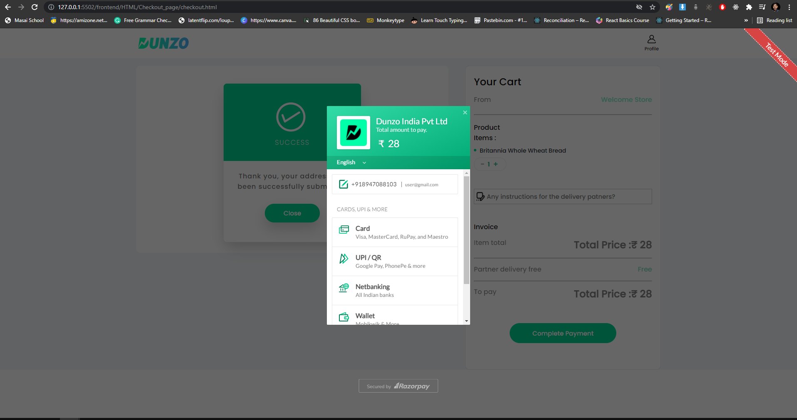

# 

##### It's an E-Commerce website(Dunzo) clone which deliver grocery items.Our team was given a task to Clone the Dunzo Website with Backend. 

## Tech stacks used: 
##### To create this clone following Tech stack is used by contributors.

### - HTML
### - CSS
### - JAVA-SCRIPT
### - MongoDB

#

## INDEX PAGE :
##### The Index Page of Dunzo website displays various store and their offers. In top section there is a Header which displays LOCATION and dropdown menu. we can add custom location for of pages. on hovered we have apply color change property. we also use modal to create our sign in and location edit option. At the bottom section there is a footer, both Header & Footer are same across all the pages. The page is responsive for all screen sizes.

#

## AFTER LOGIN PAGE :
#####  The after login page was madhe to give user extra access to the website. in that page user can buy any product and add anything to cart.

#

## LOGIN AND SIGN IN PAGE:
##### there is log in and sign up functionality both done on same sign in button. on click of that button we use modal to show login page, Dunzo allow only otp log in method so we also used that method  by providing mobile number user get otp then by applying that otp user can log in. 

## ITEM PAGES :
##### In this page user is able to acces the store near to him, we have added the store data inside this page. we have made two version of this page for give user access before log in and after log in.

##### There are many Child pages linked to the Index page and after login page, but for this clone following pages are made.

## CART ITEMS
##### In this page we can add iten in the cart for the purchace and proceed to checkout page

s

#

## Payment

#

## PRODUCT PAGES & KEY FEATURES :
### There are some Key Features which are added in website clone such as :
##### Cart 
##### All Data stored in MongoDB Backend.
##### Coupon Application feature.
#####  Use Razorpay for Payment.
##### Animated End Page added.

#

## Optimizations

We made this website so much optimized way as compared to the original website we write less no. Of code and more functional.
#
## Team Members and Contributors

### Mayur Kamthe
- *Github* : https://github.com/mayur8600/
- *Email* : mayur.kamthe62987@gmail.com
- *Linkedin* : https://www.linkedin.com/in/mayur-kamthe-0b2012157/

### Rupendra Singh
- *Github* : https://github.com/Mrrupendra/ 
- *Email* : mr.rupendra11@gmail.com
- *Linkedin* : https://www.linkedin.com/in/rupendra-singh-6430ab16a/

### Naveen Kumar
- *Github* : https://github.com/Naveenverma440/
- *Email* : naveenverma440@gmail.com
- *Linkedin* : https://www.linkedin.com/in/naveen-kumar-16ba9518b/
